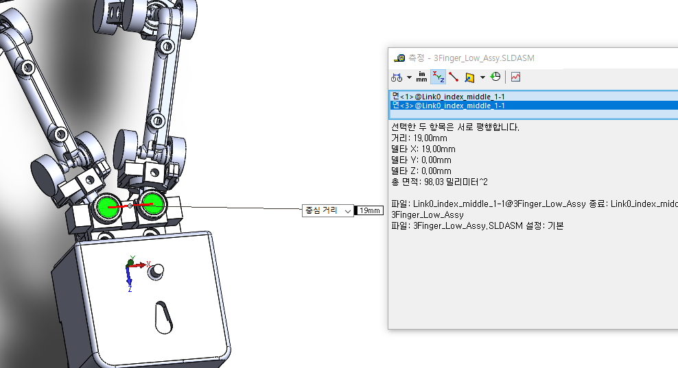
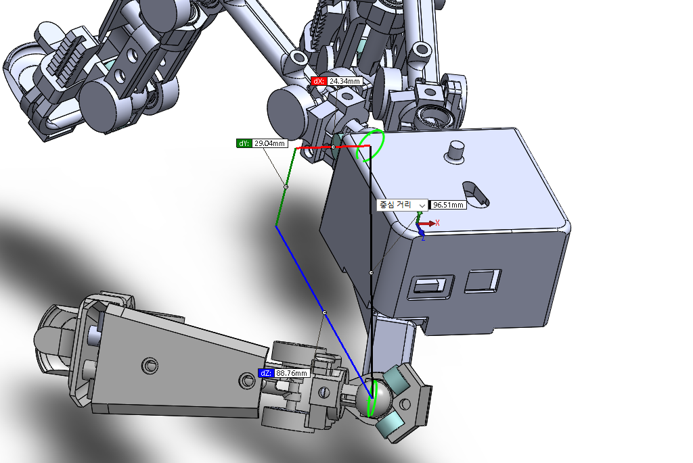

Origin과 Origin_MI사이 기계적 거리 : 19mm, matlab code상에서도 19 mm임 

    Origin=[1 0 0 0; 0 1 0 0; 0 0 1 0; 0 0 0 1];%% initial values
    Origin_MI=Origin*transl(0,0,19);%% initial values
    Origin_MIParam=[0 0 19 0 0 0];

기계적 거리는 96.51mm 코드 상에서는 아래와 같아서 THParam 수정

    Origin_TH=Origin*transl(-88.75,-29.04,-24.35)*trotz(24*pi/180)*trotx(-75*pi/180)*troty(54*pi/180)*trotz(45*pi/180);%% initial values
    Origin_THParam=[-88.75 -29.04 -24.35];
    >> sqrt(sum(Origin_THParam.^2))
    ans =
    
       96.5029